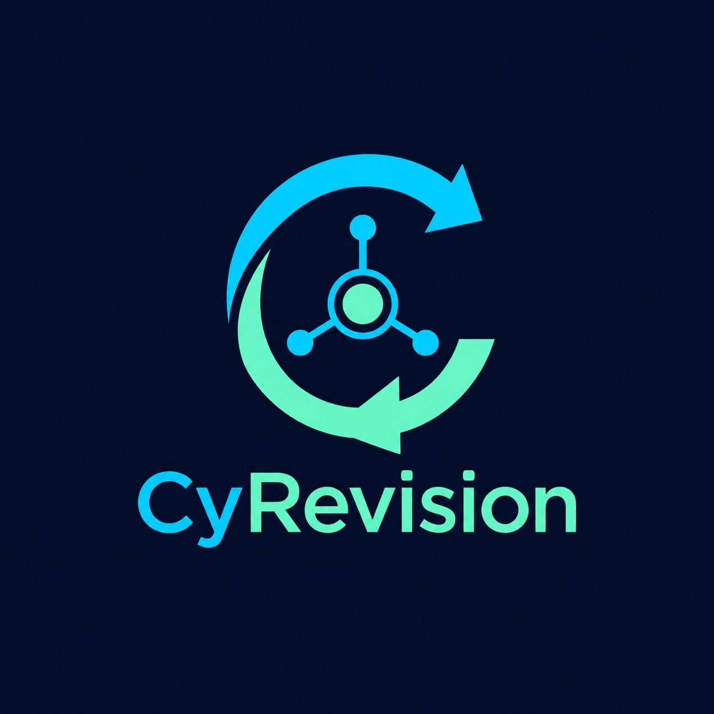

# CyRevision

<p align="center">
  
</p>

[English](README.md) · **Français**

CyRevision est un client de révision, synchronisation et sauvegarde pensé pour les projets lourds, notamment Unreal Engine. Il fonctionne sans GitHub : Git et Git LFS restent locaux, tandis que la synchronisation P2P optionnelle transporte des transactions sûres entre appareils autorisés.

> **Logiciel Alpha :** CyRevision est en développement actif. Les fonctions principales sont opérationnelles, mais les API, formats de stockage et interfaces peuvent encore évoluer. Conservez des sauvegardes indépendantes et validez la restauration avant tout usage en production.

## Fonctionnalités actuelles

- Application desktop native Windows, Linux et macOS avec Avalonia.
- Cinq modes de projet : **Git**, **Git + Sync**, **Sync**, **Sync + versions** et **Backup**.
- Git local : statut, index, commits, branches, fusion, remotes, Git LFS, explorateur interactif, comparaison A ↔ B et historique par fichier.
- Time Machine LFS : chronologie des objets, emplacements local/pair/archive, demandes signées à la demande, reprise des transferts, aperçu des textures, export et restauration confirmée.
- Visualisations Git optionnelles : commits, co-modifications, activité d'équipe et dépendances Unreal simplifiées hors moteur.
- Git P2P intelligent : bundles et inventaires signés, priorités LFS paramétrables, transferts reprenables et validation SHA-256, sans synchroniser le `.git` actif.
- Syncthing optionnel avec profil, identité, base, API loopback et port distincts pour chaque projet CyRevision.
- Admission sécurisée des pairs : invitations à usage unique, code transmis séparément, certificats ECDSA, rôles et révocation.
- Snapshots dédupliqués par SHA-256, restauration, rétention et copie non destructive vers une archive froide.
- Plan de synchronisation intelligent et paramétrable, sans démarrage implicite de Syncthing.
- Diff hors moteur : texte, texture et heatmap, OBJ, binaire et inspection simplifiée `.uasset`/`.umap`.
- Serveur Linux optionnel avec API, backups planifiés, échange Git planifié et tableau de bord web protégé.
- Plugin Unreal Editor optionnel avec ouverture de CyRevision et réservations souples non bloquantes des assets.
- WireGuard optionnel avec configuration guidée, tunnels isolés, pairs VPN-only et profils Unreal Swarm/CI/services.
- Localisation extensible : anglais par défaut, français inclus et catalogues JSON supplémentaires pour le client et le dashboard web.
- Documentation hors ligne consultable et recherchable directement dans l'application en anglais et en français.
- Gestionnaire de releases stables intégré avec sélection du paquet de la plateforme et validation SHA-256 obligatoire ; les commits, brouillons et préversions sont ignorés.

## Ouvrir dans Rider

Ouvrez `CyRevision.sln` dans JetBrains Rider. La solution cible actuellement **.NET 8**. Une migration vers .NET 10 LTS pourra être envisagée lorsque tous les environnements pris en charge le proposeront.

### Prérequis

- .NET SDK 8 ou plus récent.
- Git.
- Git LFS.
- Syncthing uniquement si un mode Sync est utilisé.
- WireGuard uniquement si le module VPN est utilisé.
- Le plugin Avalonia pour Rider est recommandé pour la prévisualisation XAML, mais reste facultatif.

## Compiler et lancer

```powershell
dotnet restore CyRevision.sln
dotnet build CyRevision.sln
dotnet test CyRevision.sln
dotnet run --project src/CyRevision.Desktop/CyRevision.Desktop.csproj
```

Publication Windows :

```powershell
./scripts/publish.ps1
```

Création locale d'un installateur Windows autonome et d'une archive portable :

```powershell
./scripts/build-release.cmd 0.1.0
```

Les paquets Linux (`.deb`) et macOS (`.dmg`) natifs sont construits par le workflow GitHub Actions multiplateforme. Ils peuvent aussi être créés sur leur système natif avec `scripts/build-linux-release.sh` et `scripts/build-macos-release.sh`. Consultez [Créer une release](docs/releasing.md).

Publication Linux :

```bash
./scripts/publish.sh
```

## Règle de sécurité Syncthing

CyRevision ne recherche, ne configure et n'arrête jamais une installation Syncthing personnelle existante. Un processus n'est lancé qu'après activation de Sync et sélection explicite de l'exécutable. CyRevision ne peut arrêter que l'instance enfant exacte qu'il a créée.

En mode **Git + Sync**, le dossier partagé contient les bundles Git signés, les certificats d'appartenance, les inventaires LFS signés et les objets LFS immuables adressés par leur contenu. Le working tree et le `.git` actif restent locaux. En mode **Sync sans Git**, Syncthing partage directement le dossier de projet sélectionné.

## Documentation

- [Guide utilisateur](docs/user-guide.md)
- [Architecture](docs/architecture.md)
- [Sécurité](docs/security.md)
- [Serveur Linux optionnel](docs/linux-server.md)
- [Diff d'assets hors moteur](docs/asset-diff.md)
- [API serveur](docs/server-api.md)
- [VPN WireGuard](docs/wireguard-vpn.md)
- [Visualisations Git](docs/git-visualizations.md)
- [Explorateur Git et Time Machine LFS](docs/git-explorer-lfs-time-machine.md)
- [Synchronisation intelligente et archive froide](docs/smart-sync-and-cold-archive.md)
- [Localisation](docs/localization.md)
- [Créer une release multiplateforme](docs/releasing.md)
- [Pont Unreal Editor](plugins/CyRevisionUnreal/README.md)

## Licence

CyRevision est distribué sous la [GNU Affero General Public License v3.0](LICENSE).
