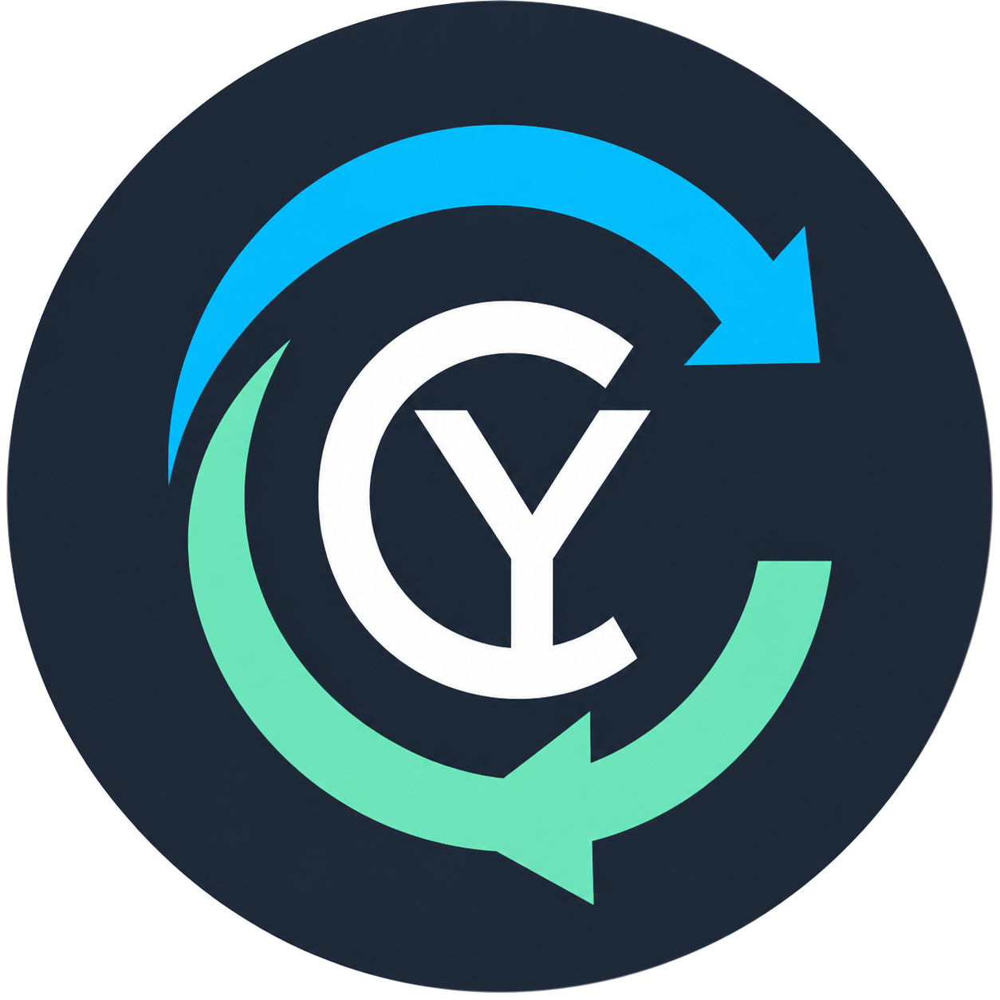

# CyRevision

<p align="center">
  
</p>

**English** · [Français](README.fr.md)

CyRevision is a revision control, synchronization, and backup client designed for large projects, especially Unreal Engine productions. It does not require GitHub: Git and Git LFS remain local, while optional peer-to-peer synchronization transports verified transactions between authorized devices.

> **Alpha software:** CyRevision is under active development. The core workflows are functional, but APIs, storage formats, and user interfaces may still change. Keep independent backups and validate recovery before production use.

## Current capabilities

- Native Avalonia desktop application for Windows, Linux, and macOS, with a system tray, close-to-tray behavior, and per-user launch-at-login integration.
- Core project modes for **Git**, **Git + Sync**, **Sync**, **Sync + Versions**, and **Backup**, plus optional project-scoped modes contributed by plugins.
- Integrated GitHub pull request manager with repository detection, colored ownership/state/CI indicators, request creation, files and patches, conversations, reviews, CI logs and reruns, non-destructive conflict inspection, safe local checkout, confirmed merge operations, and safe local branch cleanup. Provider adapters keep the module open to other forges.
- Local Git workflows: status, staging, commits, branches, merges, remotes, Git LFS, an interactive history explorer, A ↔ B comparisons, and per-file history.
- Safe Multi Restore composer: select several files from one commit, independently choose the version before or at that commit, preview restore/delete operations, protect local changes, verify LFS availability, and create a timestamped recovery copy without touching the index or creating a commit.
- Branch comparison and cherry-pick composer with patch-equivalence detection, explicit commit ordering, separate or combined commit modes, conflict rollback, and temporary Git worktrees for updating an inactive local target branch without switching the displayed project or pushing automatically.
- LFS Time Machine with object history, local/peer/archive availability, signed on-demand requests, resumable transfers, texture previews, export, and confirmed restore operations.
- Optional safe LFS storage manager with dedicated `lfs.storage` relocation, dry-run classification, local-ref protection, verified remote/peer/archive evidence, audit logs, and blocked deletion when the local machine may hold the last copy.
- Optional **Git + CyStore — ALPHA** plugin mode with explicit capture of hydrated Git LFS files, content-defined 1–8 MiB chunks, SHA-256 verification, cross-version deduplication, and non-destructive reconstruction; Git commits, remotes and LFS pointers are never rewritten.
- Optional Git visualizations for commit history, co-change relations, team activity, and simplified engine-independent Unreal dependencies.
- Intelligent peer-to-peer Git exchange using signed bundles and inventories, configurable LFS priorities, resumable transfers, and SHA-256 verification without synchronizing the active `.git` directory.
- Optional Syncthing integration with a dedicated profile, identity, database, loopback API, and port for every CyRevision project.
- Secure peer admission with single-use invitations, out-of-band verification codes, ECDSA certificates, roles, and revocation.
- SHA-256 deduplicated snapshots with restore, retention policies, and non-destructive cold-archive copies.
- Configurable smart synchronization planning without implicitly starting Syncthing.
- Engine-independent comparisons for text, textures and heatmaps, OBJ geometry, binary files, and simplified `.uasset`/`.umap` inspection.
- Optional Linux server with an API, scheduled backups, scheduled Git exchange, and a protected web dashboard.
- Optional runtime-loaded CyRevision plugins with per-user enable/disable state; Unreal integration is shipped separately and disabled by default.
- Autonomous Unreal Editor plugin with a revision dashboard, Git actions, advisory asset reservations, and an authenticated loopback bridge to CyRevision.
- Unreal plugin installation and safe updates from the CyRevision Plugins page, with recoverable backups of the previous project plugin.
- Optional, project-scoped Perforce Helix Core plugin using the official `p4` CLI for validated workspaces, opened files, changelists, history, reconcile, sync, revert, and submit; writes are disabled by default and credentials are never stored.
- Optional, project-scoped Jira Cloud and ClickUp integrations for searching work items, adding stable task links, auto-detecting them in pull requests, and applying confirmed or automatic completion transitions after merge; session tokens are never persisted.
- Optional WireGuard integration with a selectable system or bundled runtime, guided Windows/macOS/Linux firewall setup, router/NAT checklists, signed Sync-assisted onboarding, isolated tunnels, VPN-only peers, and Unreal Swarm/CI/service profiles.
- Unreal Swarm over VPN workspace with Agent/Coordinator roles, safe Agent XML backups, reversible local DNS aliases, VPN-only firewall rules, process controls, and actionable end-to-end diagnostics; matching autonomous tools are included in CyRevisionUnreal.
- Secure VPN file inbox and explicit folder sharing with VPN-address binding, subnet filtering, project token authentication, SHA-256 verification, no overwrites, and traversal/symlink protection.
- Optional headless remote-build agent for Windows, Linux, and macOS: VPN-scoped bearer authentication, server-side allowlisted recipes, synchronized-workspace or uploaded-snapshot modes, live logs, cancellation, and artifact download without pushing a temporary branch.
- Optional Discord agent with integrated and autonomous sidecar modes, authenticated LAN/VPN control, channel-scoped webhooks, grouped commit notifications, branch-change notices, and per-project duplicate prevention without requiring GitHub.
- Extensible localization: English is the default, French is included, and additional JSON catalogs can be added to the desktop client and web dashboard.
- Searchable offline documentation bundled with the desktop application in English and French.
- Rider-style Code workspace with a full project tree, fast Ctrl+Shift+F search, file patterns, symbol outline, text preview, and Git history for files, folders, or selected lines.
- Compact Rider-style project navigation plus freely resizable detached History, Code, Multi Restore, and Cherry-pick workspaces for multi-monitor review.
- Optional AI Workspace plugin for Codex CLI, OpenAI Responses API, compatible APIs, Ollama, and LM Studio, with explicit read/edit/network/stage/commit permissions and no automatic push.
- Project-scoped MCP manager for STDIO and Streamable HTTP servers, local-only profiles, environment-based secrets, server/tool allow and deny lists, approval modes, timeouts, unmanaged-server isolation, and an emergency block switch.
- Built-in stable-release updater with platform package selection and mandatory SHA-256 verification; commits, drafts, and prereleases are ignored.

## Open in Rider

Open `CyRevision.sln` in JetBrains Rider. The solution currently targets **.NET 8**. A future migration to .NET 10 LTS can be considered once all supported environments provide it.

### Requirements

- .NET SDK 8 or newer.
- Git.
- Git LFS.
- Syncthing only when a Sync mode is enabled.
- WireGuard only when the VPN module is enabled.
- The Avalonia plugin for Rider is recommended for XAML previews but is not required.

## Build and run

```powershell
dotnet restore CyRevision.sln
dotnet build CyRevision.sln
dotnet test CyRevision.sln
dotnet run --project src/CyRevision.Desktop/CyRevision.Desktop.csproj
```

Publish on Windows:

```powershell
./scripts/publish.ps1
```

Build a self-contained Windows installer and portable release locally:

```powershell
./scripts/build-release.cmd 0.1.21
```

Native Linux (`.deb`) and macOS (`.dmg`) packages are built by the multiplatform GitHub Actions release workflow. They can also be built on their native operating system with `scripts/build-linux-release.sh` and `scripts/build-macos-release.sh`. See [Creating a release](docs/releasing.md).

Publish on Linux:

```bash
./scripts/publish.sh
```

## Syncthing safety rule

CyRevision never discovers, configures, or stops an existing personal Syncthing installation. It starts a process only after Sync has been enabled and a Syncthing executable has been selected explicitly. CyRevision can stop only the exact child process instance it created.

In **Git + Sync** mode, the shared directory contains signed Git bundles, membership certificates, signed LFS inventories, and immutable content-addressed LFS objects. The working tree and active `.git` directory remain local. In **Sync without Git** mode, Syncthing shares the selected project directory directly.

## Documentation

Detailed documentation is currently available in French while its English translation is being prepared:

- [User guide](docs/user-guide.md)
- [Architecture](docs/architecture.md)
- [Security](docs/security.md)
- [Optional Linux server](docs/linux-server.md)
- [Engine-independent asset diff](docs/asset-diff.md)
- [Server API](docs/server-api.md)
- [WireGuard VPN](docs/wireguard-vpn.md)
- [Discord project agent](docs/discord-agent.md)
- [Git visualizations](docs/git-visualizations.md)
- [Git explorer and LFS Time Machine](docs/git-explorer-lfs-time-machine.md)
- [Smart synchronization and cold archive](docs/smart-sync-and-cold-archive.md)
- [Localization](docs/localization.md)
- [Creating a multiplatform release](docs/releasing.md)
- [Unreal Editor bridge](plugins/CyRevisionUnreal/README.md)
- [CyRevision plugins and Unreal installation](docs/plugins-and-unreal.md)
- [Code explorer, global search, and AI workspace](docs/code-explorer-and-ai.md)
- [CyStore Alpha chunk storage](docs/cystore-alpha.md)
- [Pull request manager](docs/pull-request-manager.md)

## License

CyRevision is licensed under the [GNU Affero General Public License v3.0](LICENSE).
